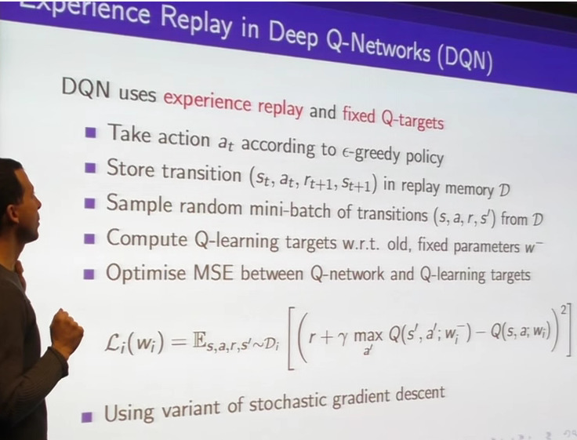
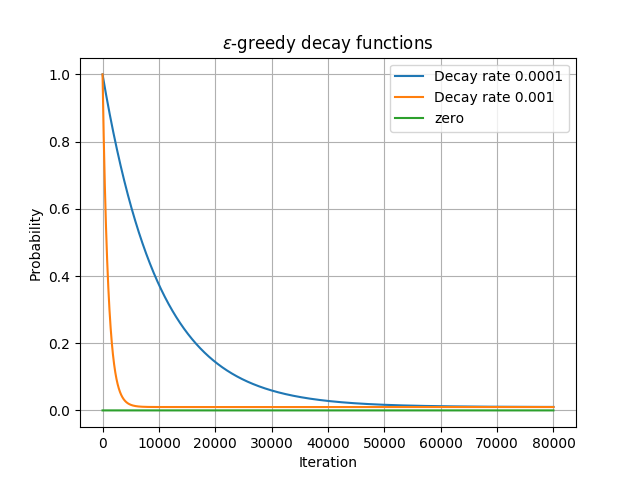

# Deep Reinforcement Learning experiments

This is an implementation of a Deep Reinforcement learning agent based
on David Silver's lectures. The figure below summarizes the technique.

The initial implementation was heavily inspired by Mat Leonard's [jupyter
notebook](/udacity/deep-learning/blob/master/reinforcement/Q-learning-cart.ipynb)

As shown in the slide above, we use an epsilon greedy policy for learning, and
implement this function following an exponential decay, as shown in the graph
below.

